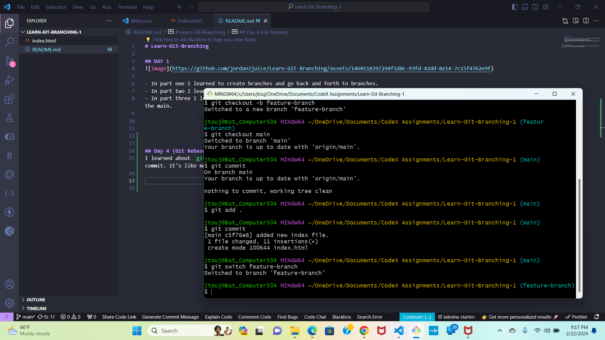
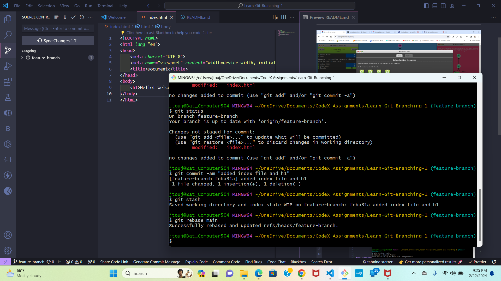

# Learn-Git-Branching

## DAY 1

- In part one I learned to create branches and go back and forth to branches.
- In part two I learned to move parts of the branch and the head to different commits.
- In part three I learned how to cherry-pick commits that copies to the main as well as shuffle them around with rebase and copy them to the main.

## Day 4 (Git Rebase)
I learned about `git rebase` which is a way to integrate changes from one branch into another without creating an unnecessary merge commit. It's like merging, but instead of making a merge commit.

I made a change to my main branch and created a new branch called "feature-branch."

I stashed the changes for the new branch. The p tag dissapeared in the new branch.  I then rebased the main branch to the new branchm and there was no errors in the terminal. 