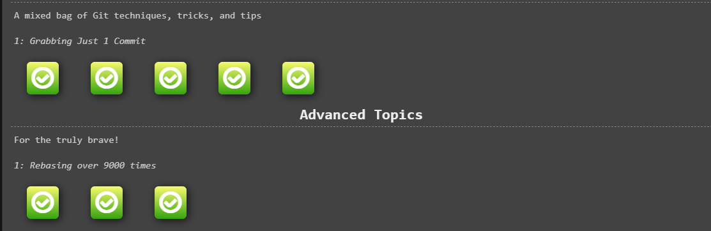
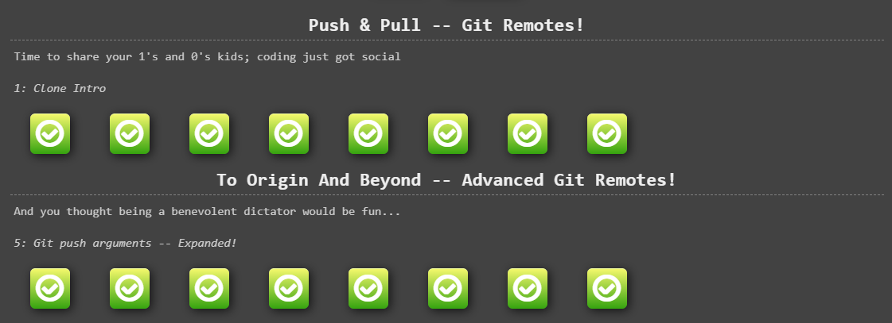
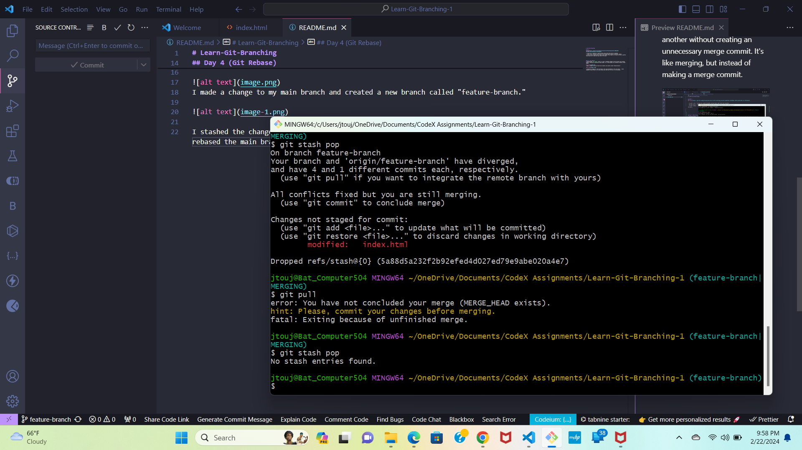

# Learn-Git-Branching

## DAY 1

- In part one, I learned to create branches and go back and forth between branches.
- In part two I learned to move parts of the branch and the head to different commits.
- In part three I learned how to cherry-pick commits that copy to the main as well as shuffle them around with rebase and copy them to the main.

## Day 2 - Cherry-pick and Rebase

With Cherry-pic and rebase you can copy and move commits around to different commits and branches. Cherry-pick can set a new branch in the tree of copied commits.

## Day 3 - Remote Git

In this part of the assignment was about pushing, pulling, and fetching branches and commits from the local branch and the remote repository.
I had a hard time understanding how to use `git push origin <branch>` so I did some research on it.

Here is what I discovered:

- When you do `git clone http://github.com/username/repo` you are actually doing `git clone http://github.com/username/repo master`. So, when you type

- `git push origin master` will only send your local master branch up to GitHub, whereas `git push origin :master` (note the
- `git push origin master` will only send your local master branch to the remote repository, not any other branches you may have created locally. If
- When you do `git push origin <branch> `, git will try to sync your local `<branch>` with the remote `<branch>` in the repository
- `git push origin <branch>`: This command will push your local `<branch>` up to the remote repository, but if that branch doesn't
- `git push origin <branch>`: This command will push your local `<branch>` up to the remote repository named `<branch>`. If there

## Day 4 (Git Rebase)

I learned about `git rebase` which is a way to integrate changes from one branch into another without creating an unnecessary merge commit. It's like merging, but instead of making a merge commit.

I made a change to my main branch and created a new branch called "feature-branch."

I stashed the changes for the new branch. The p tag disappeared in the new branch. I then rebased the main branch to the new branch and there were no errors in the terminal.

I fixed the merge conflict and then I made the merge commit. I stashed the file then I made the merge commit.

## Day 5 - Repository Management
First I went to my profile and clicked on "Your Organizations"  Then I sent one up with a name an email verified myself made it personal and clicked ok.

Here is a screenshot of my organization page:

Then I go to the setting under a repository and scroll down to the "Danger Zone." From there I can switch the repository to be under my profile to my new organization.

Here is a screenshot of the repository in my new organization.

